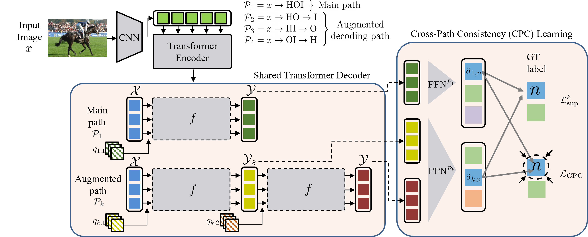

# CPC
Official PyTorch Implementation for CVPR2022 paper "Consistency Learning via Decoding Path Augmentation for Transformers in Human Object Interaction Detection"

This repository contains the application of CPC at [QPIC](https://arxiv.org/abs/2103.05399). This is based on the official implementation of QPIC in [here](https://github.com/hitachi-rd-cv/qpic).

<div align="center">
  
</div>
<!-- 
<div align="center">
  
  <p>Example attention maps.</p>
</div> -->

## Preparation

### Installation
- Requirements 
Install torch 1.8.0 and other requirements.txt.
```
pip install -r requirements.txt
```


### Dataset

#### HICO-DET
HICO-DET dataset can be downloaded [here](https://drive.google.com/open?id=1QZcJmGVlF9f4h-XLWe9Gkmnmj2z1gSnk). After finishing downloading, unpack the tarball (`hico_20160224_det.tar.gz`) to the `data` directory.

Instead of using the original annotations files, we use the annotation files provided by the PPDM authors. The annotation files can be downloaded from [here](https://drive.google.com/open?id=1WI-gsNLS-t0Kh8TVki1wXqc3y2Ow1f2R). The downloaded annotation files have to be placed as follows.
```
qpic
 |─ data
 │   └─ hico_20160224_det
 |       |─ annotations
 |       |   |─ trainval_hico.json
 |       |   |─ test_hico.json
 |       |   └─ corre_hico.npy
 :       :
```

#### V-COCO
First clone the repository of V-COCO from [here](https://github.com/s-gupta/v-coco), and then follow the instruction to generate the file `instances_vcoco_all_2014.json`. Next, download the prior file `prior.pickle` from [here](https://drive.google.com/drive/folders/10uuzvMUCVVv95-xAZg5KS94QXm7QXZW4). Place the files and make directories as follows.
```
qpic
 |─ data
 │   └─ v-coco
 |       |─ data
 |       |   |─ instances_vcoco_all_2014.json
 |       |   :
 |       |─ prior.pickle
 |       |─ images
 |       |   |─ train2014
 |       |   |   |─ COCO_train2014_000000000009.jpg
 |       |   |   :
 |       |   └─ val2014
 |       |       |─ COCO_val2014_000000000042.jpg
 |       |       :
 |       |─ annotations
 :       :
```
For our implementation, the annotation file have to be converted to the HOIA format. The conversion can be conducted as follows.
```
PYTHONPATH=data/v-coco \
        python convert_vcoco_annotations.py \
        --load_path data/v-coco/data \
        --prior_path data/v-coco/prior.pickle \
        --save_path data/v-coco/annotations
```
Note that only Python2 can be used for this conversion because `vsrl_utils.py` in the v-coco repository shows a error with Python3.

V-COCO annotations with the HOIA format, `corre_vcoco.npy`, `test_vcoco.json`, and `trainval_vcoco.json` will be generated to `annotations` directory.

### Pre-trained parameters
Our QPIC have to be pre-trained with the COCO object detection dataset. For the HICO-DET training, this pre-training can be omitted by using the parameters of DETR. The parameters can be downloaded from [here](https://dl.fbaipublicfiles.com/detr/detr-r50-e632da11.pth) for the ResNet50 backbone, and [here](https://dl.fbaipublicfiles.com/detr/detr-r101-2c7b67e5.pth) for the ResNet101 backbone. For the V-COCO training, this pre-training has to be carried out because some images of the V-COCO evaluation set are contained in the training set of DETR. You have to pre-train QPIC without those overlapping images by yourself for the V-COCO evaluation.

For HICO-DET, move the downloaded parameters to the `params` directory and convert the parameters with the following command.
```
python convert_parameters.py \
        --load_path params/detr-r50-e632da11.pth \
        --save_path params/detr-r50-pre-hico-cpc.pth
```

For V-COCO, convert the pre-trained parameters with the following command.
```
python convert_parameters.py \
        --load_path params/detr-r50-e632da11.pth \
        --save_path params/detr-r50-pre-vcoco-cpc.pth \
        --dataset vcoco
```

## Training
After the preparation, you can start the training with the following command.

For the HICO-DET training.
```
GPUS_PER_NODE=8 ./tools/run_dist_launch.sh 8 ./configs/hico_train.sh
```
For the V-COCO training.
```
GPUS_PER_NODE=8 ./tools/run_dist_launch.sh 8 ./configs/vcoco_train.sh
```
## Evaluation
For evaluation of main inference path P1 (x->HOI), `--path_id` should be set to 0. 
Indexes of Augmented paths are range to 1~3. (1: x->HO->I, 2: x->HI->O, 3: x->OI->H)

HICODET
```
python main.py \
        --pretrained checkpoints/hicodet/logs/qpic_cpc_resnet50_hico.pth \
        --hoi \
        --dataset_file hico \
        --hoi_path data/hico_20160224_det \
        --num_obj_classes 80 \
        --num_verb_classes 117 \
        --share_dec_param \ 
        --backbone resnet50 \
        --path_id 0 \
        --eval
```

VCOCO
```
python generate_vcoco_official.py \
        --param_path checkpoints/hicodet/logs/qpic_cpc_resnet50_vcoco.pth \
        --save_path vcoco.pickle \
        --share_dec_param \ 
        --path_id 0 \
        --hoi_path data/v-coco
```
## Citation
Please consider citing our paper if it helps your research.
```
@inproceedings{park2022consistency,
  title={Consistency Learning via Decoding Path Augmentation for Transformers in Human Object Interaction Detection},
  author={Park, Jihwan and Lee, SeungJun and Heo, Hwan and Choi, Hyeong Kyu and Kim, Hyunwoo J},
  booktitle={Proceedings of the IEEE/CVF Conference on Computer Vision and Pattern Recognition},
  year={2022}
}
```
